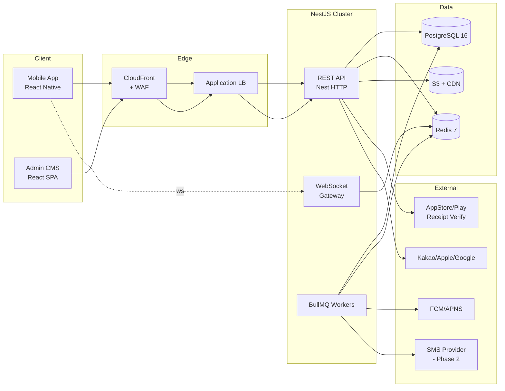

# A-idol — Clean Architecture & Tech Stack (A-아이돌 아키텍처 정의서)

## 1. Architecture Principles (아키텍처 원칙)

1. **Dependency Rule (의존성 규칙)** — 안쪽 레이어는 바깥 레이어를 모른다.
   `Entity → UseCase → Interface Adapter → Infrastructure`
2. **Framework Independence** — NestJS, Prisma, React Native 등 프레임워크는 가장 바깥 레이어에만 위치.
3. **Testability** — UseCase는 in-memory repository / mock gateway 만으로 단위 테스트 가능.
4. **Mobile-first** — 모든 사용자 기능은 모바일 UX에 최적화. CMS는 별도 React SPA.
5. **Clear Bounded Contexts** — 도메인 모듈 경계를 명확히 (Identity, Catalog, Fandom, Chat, Audition, Commerce, Content, Notification).

## 2. Layer Definition (레이어 정의)

| Layer | Contents | Backend Example | Mobile Example |
|-------|----------|-----------------|----------------|
| **Entity (도메인 엔티티)** | 비즈니스 규칙을 가진 핵심 객체 | `Idol`, `FanClub`, `ChatCoupon`, `Vote`, `PhotoCard` | 공용 `@a-idol/domain` 패키지 |
| **UseCase (애플리케이션 규칙)** | 유즈케이스 orchestration | `JoinFanClubUseCase`, `CastVoteUseCase` | `FetchIdolDetailUseCase` |
| **Interface Adapter** | Controller / Presenter / Repository Impl | `IdolController`, `PrismaIdolRepository` | RN 화면 ViewModel, HTTP Client |
| **Infrastructure / Frameworks** | NestJS, Prisma, Redis, PG, FCM | Nest 모듈, Prisma 스키마 | React Native, Reanimated, SQLite cache |

## 3. Target Tech Stack (기술 스택)

### 3.1 Mobile (React Native)
- RN 0.74+, TypeScript strict
- Navigation: `@react-navigation/native` (Stack + Bottom Tabs)
- State: `zustand` (UI) + `@tanstack/react-query` (server cache)
- Styling: `tamagui` 또는 `nativewind` (추후 결정 — ADR-001)
- Animation: `react-native-reanimated` v3
- Push: `@react-native-firebase/messaging` + APNS
- IAP: `react-native-iap`
- WebSocket: `socket.io-client` (NestJS gateway와 쌍)
- Local cache: `react-native-mmkv` + `expo-sqlite` (옵션)
- Test: Jest + React Native Testing Library + Detox(E2E)

### 3.2 Web CMS (React)
- Vite + React 18 + TypeScript
- UI: `shadcn/ui` + Tailwind CSS
- Data grid: `@tanstack/react-table`
- Forms: `react-hook-form` + `zod`
- Charts: `recharts`
- Auth: OAuth2 + JWT (백엔드와 공유)
- Test: Vitest + Playwright

### 3.3 Backend (NestJS)
- Node 20 LTS + TypeScript strict
- Framework: NestJS 10 (modular, DI)
- ORM: Prisma 5 (PostgreSQL)
- Auth: Passport + JWT(access 15m) + Refresh(14d, rotating)
- Validation: `class-validator` + `class-transformer`
- WebSocket: `@nestjs/websockets` + socket.io adapter (Redis pub/sub)
- Queue: `BullMQ` on Redis (푸시 발송, 결제 검증, 투표 집계 배치)
- File: S3 Pre-signed Upload
- Observability: OpenTelemetry → Datadog / Sentry
- Test: Jest + Supertest, Testcontainers(PostgreSQL)

### 3.4 Data & Infra
- Primary DB: **PostgreSQL 16** (read replica 추가 가능)
- Cache / PubSub: **Redis 7**
- Object storage: S3 + CloudFront CDN
- Container: Docker, Orchestration: ECS Fargate 또는 EKS (추후 확정 — ADR-002)
- CI/CD: GitHub Actions → (mobile) EAS Build, (backend) Docker → ECR → ECS

## 4. System Topology (시스템 구성도)



## 5. Module / Bounded Context Map (모듈 맵)

| Context | Responsibility | Key Aggregates |
|---------|----------------|----------------|
| **Identity** | 회원, 인증, 세션, 약관동의 | `User`, `AuthSession`, `ConsentLog` |
| **Catalog** | 아이돌 프로필, 소속사, 스케줄 | `Idol`, `Agency`, `Schedule` |
| **Fandom** | 좋아요, 팔로우, 팬클럽 | `Heart`, `Follow`, `FanClub`, `Membership` |
| **Chat** | 1:1 아이돌 채팅, 쿠폰, 자동 메시지 | `ChatRoom`, `ChatMessage`, `ChatCoupon`, `AutoMessageTemplate` |
| **Audition** | 예선/결선, 투표권, 집계 | `Audition`, `Round`, `Vote`, `VoteRule`, `Ranking` |
| **Commerce** | IAP, 영수증, 포토카드 구매 | `Order`, `ReceiptVerification`, `PhotoCardSet`, `PhotoCardItem`, `UserInventory` |
| **Content** | 피드, 공지, 미디어 | `Post`, `MediaAsset` |
| **Notification** | 푸시, 인앱 알림 | `PushToken`, `Notification` |
| **AdminOps** | CMS 전용 (RBAC, 대시보드, 통계) | `AdminUser`, `Role`, `AuditLog` |

## 6. Repo Layout (모노레포 구조)

```
a-idol/
├─ packages/
│  ├─ mobile/                # React Native app
│  │  ├─ src/
│  │  │  ├─ domain/          # Entity + UseCase (shared with backend via @a-idol/domain)
│  │  │  ├─ data/            # HTTP client, WS client, MMKV
│  │  │  ├─ ui/              # Screens, components
│  │  │  └─ app/             # Navigation, DI
│  ├─ cms/                   # React SPA for admins
│  ├─ backend/               # NestJS
│  │  ├─ src/
│  │  │  ├─ modules/
│  │  │  │  ├─ identity/
│  │  │  │  ├─ catalog/
│  │  │  │  ├─ fandom/
│  │  │  │  ├─ chat/
│  │  │  │  ├─ audition/
│  │  │  │  ├─ commerce/
│  │  │  │  ├─ content/
│  │  │  │  └─ notification/
│  │  │  ├─ shared/          # cross-cutting (logger, guards, pipes)
│  │  │  └─ main.ts
│  │  └─ prisma/
│  └─ shared/
│     ├─ domain/             # Pure entities + value objects (platform-agnostic)
│     └─ contracts/          # DTO, OpenAPI schema
├─ docs/                     # this SDLC documentation
├─ sql/                      # DDL, migration notes
└─ .github/
   ├─ ISSUE_TEMPLATE/
   └─ workflows/
```

## 7. Backend Module Skeleton (Clean Arch in NestJS)

예시 — Fandom 컨텍스트의 `JoinFanClub` 유즈케이스.

```ts
// packages/shared/domain/fan-club.ts
export class FanClub {
  constructor(
    public readonly id: string,
    public readonly idolId: string,
    public readonly tier: 'official'
  ) {}
}

// packages/shared/domain/membership.ts
export class Membership {
  constructor(
    public readonly userId: string,
    public readonly fanClubId: string,
    public readonly joinedAt: Date
  ) {}
  canChat(): boolean { return true; }
}
```

```ts
// packages/backend/src/modules/fandom/application/join-fan-club.usecase.ts
export interface FanClubRepository {
  findById(id: string): Promise<FanClub | null>;
}
export interface MembershipRepository {
  exists(userId: string, fanClubId: string): Promise<boolean>;
  save(m: Membership): Promise<void>;
}

@Injectable()
export class JoinFanClubUseCase {
  constructor(
    @Inject('FanClubRepository') private readonly clubs: FanClubRepository,
    @Inject('MembershipRepository') private readonly memberships: MembershipRepository,
    private readonly clock: Clock,
  ) {}

  async execute(input: { userId: string; fanClubId: string }): Promise<Membership> {
    const club = await this.clubs.findById(input.fanClubId);
    if (!club) throw new DomainError('FAN_CLUB_NOT_FOUND');
    if (await this.memberships.exists(input.userId, input.fanClubId)) {
      throw new DomainError('ALREADY_MEMBER');
    }
    const membership = new Membership(input.userId, input.fanClubId, this.clock.now());
    await this.memberships.save(membership);
    return membership;
  }
}
```

```ts
// packages/backend/src/modules/fandom/infrastructure/prisma-fan-club.repository.ts
@Injectable()
export class PrismaFanClubRepository implements FanClubRepository {
  constructor(private readonly prisma: PrismaService) {}
  async findById(id: string) { /* maps prisma.fanClub → domain FanClub */ }
}

// packages/backend/src/modules/fandom/presentation/fandom.controller.ts
@Controller('fan-clubs')
export class FandomController {
  constructor(private readonly join: JoinFanClubUseCase) {}
  @Post(':id/join') @UseGuards(JwtAuthGuard)
  async joinClub(@CurrentUser() user, @Param('id') id: string) {
    const m = await this.join.execute({ userId: user.id, fanClubId: id });
    return MembershipDto.from(m);
  }
}
```

## 8. Cross-cutting Concerns (공통 관심사)

| Concern | Approach |
|---------|----------|
| Logging | pino structured logs, `requestId` trace, Datadog ingest |
| Error | `DomainError` (비즈니스) vs `AppError` (시스템), NestExceptionFilter가 문제 상태 코드 매핑 |
| Auth | JWT access + refresh rotation, `@CurrentUser()` decorator |
| RBAC (CMS) | `roles: ['super_admin','content_admin','audition_admin','cs_admin']` + `PermissionGuard` |
| Secrets | AWS Secrets Manager, `.env.example` only in repo |
| Config | `@nestjs/config` + `zod` schema validation at boot |
| i18n | MVP: ko-KR only, 리소스 파일로 Key 기반 관리 (`translation.ko.json`) |
| Rate limit | `@nestjs/throttler` + Redis (투표/채팅 쿠폰 구매 특히) |
| Idempotency | 결제: `Idempotency-Key` 헤더 + 영수증 고유키, 투표: userId+roundId UNIQUE |
| Observability | OpenTelemetry traces + Prometheus metrics + Sentry errors |

## 9. ADRs (아키텍처 결정 목록 — 초기)

| ID | Decision | Status |
|----|----------|--------|
| ADR-001 | RN styling: Tamagui vs NativeWind | Pending (PoC after kickoff) |
| ADR-002 | ECS Fargate vs EKS | Pending (DevOps 합류 후 결정) |
| ADR-003 | Prisma 채택 (Kysely 대신) — 타입 안정성 우선 | Accepted |
| ADR-004 | 결선 문자투표 MVP 스텁 처리 | Accepted |
| ADR-005 | 이미지 원본 S3 + 썸네일 Lambda 리사이즈 | Accepted |

변경/추가 시 `docs/adr/ADR-XXX-*.md` 로 관리.
