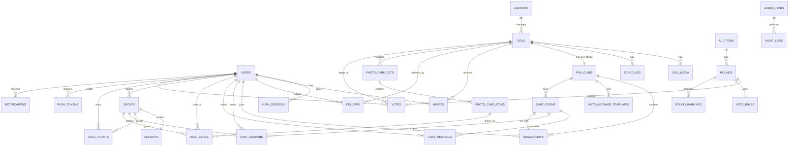

# A-idol — Entity Relationship Diagram (A-아이돌 ERD)

PostgreSQL 16 기준. 상세 DDL은 [`sql/a-idol-schema.sql`](../../sql/a-idol-schema.sql) 참조.

## ER Diagram (Mermaid)

## Table Overview (테이블 요약)

| Domain | Table | Purpose |
|--------|-------|---------|
| Identity | `users` | 회원 마스터 |
|  | `auth_sessions` | refresh token 저장 |
|  | `consent_logs` | 약관/개인정보 동의 이력 |
| Catalog | `agencies` | 소속사 |
|  | `idols` | 아이돌 프로필 |
|  | `idol_media` | 사진/영상 자산 |
|  | `schedules` | 아이돌 스케줄 |
| Fandom | `hearts` | 좋아요 |
|  | `follows` | 팔로우 |
|  | `fan_clubs` | 아이돌당 1개 공식 팬클럽 |
|  | `memberships` | 팬클럽 가입 |
| Chat | `chat_rooms` | 1:1 채팅방 |
|  | `chat_messages` | 메시지 이력 |
|  | `chat_coupons` | 쿠폰 잔액 |
|  | `auto_message_templates` | 굿모닝/굿나잇/뭐해요? |
| Commerce | `orders` | 주문 헤더 |
|  | `receipts` | 스토어 영수증 (idempotency) |
|  | `photo_card_sets` | 포토카드 세트 (12장 기준) |
|  | `photo_card_items` | 세트 내 개별 카드 |
|  | `user_cards` | 유저 보유 카드 |
| Audition | `auditions` | 오디션 프로그램 |
|  | `rounds` | 회차 (예선1~10/결선) |
|  | `vote_rules` | 온라인/문자/인기도 가중치 |
|  | `vote_tickets` | 투표권 잔액 |
|  | `votes` | 투표 이벤트 |
|  | `round_rankings` | 집계 결과 |
| Content | `posts` | 피드 포스트 |
|  | `media_assets` | 이미지/동영상 |
| Notification | `push_tokens` | FCM/APNS 토큰 |
|  | `notifications` | 알림 이력 |
| AdminOps | `admin_users` | CMS 관리자 |
|  | `roles` | RBAC 정의 |
|  | `audit_logs` | 변경 이력 |

## Key Design Notes (설계 노트)

- **UUID v7**을 기본 PK로 사용 (시간 정렬 + 분산 환경).
- **Soft delete**: `deleted_at` 컬럼 보편 적용(결제/투표 등 이벤트는 하드 삭제 금지).
- **Multi-tenant 이슈**: 소속사(`agency_id`)로 데이터 격리 (CMS 쿼리는 role 기반 필터).
- **파티셔닝**: `chat_messages`, `votes`는 월별 파티션 (Range Partition on `created_at`).
- **금액 컬럼**: `NUMERIC(14,2)` 사용, 원화 기본.
- **타임존**: `TIMESTAMPTZ` UTC 저장, API 응답 시 클라이언트 타임존 변환.
- **Row-level concurrency**: `chat_coupons.balance`, `vote_tickets.balance` 업데이트는 `WHERE balance >= :n` + `UPDATE ... RETURNING`로 낙관적 원자성 유지.

## Migration Notes

- 초기 시딩: `idols` 99행 + `fan_clubs` 99행 + `auto_message_templates` 아이돌당 3개.
- Phase 2에서 포토카드 중복 보상 로직 추가 시 `user_card_rewards` 테이블 도입 예정.
