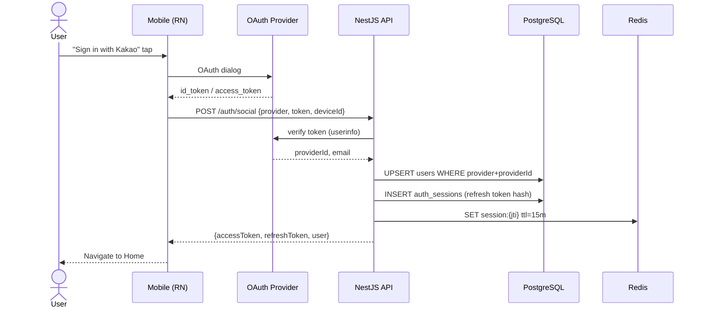
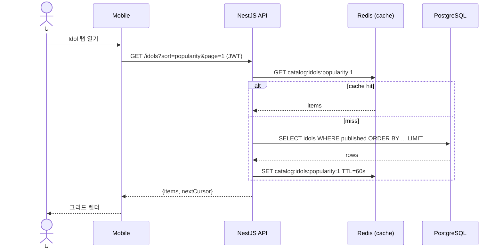
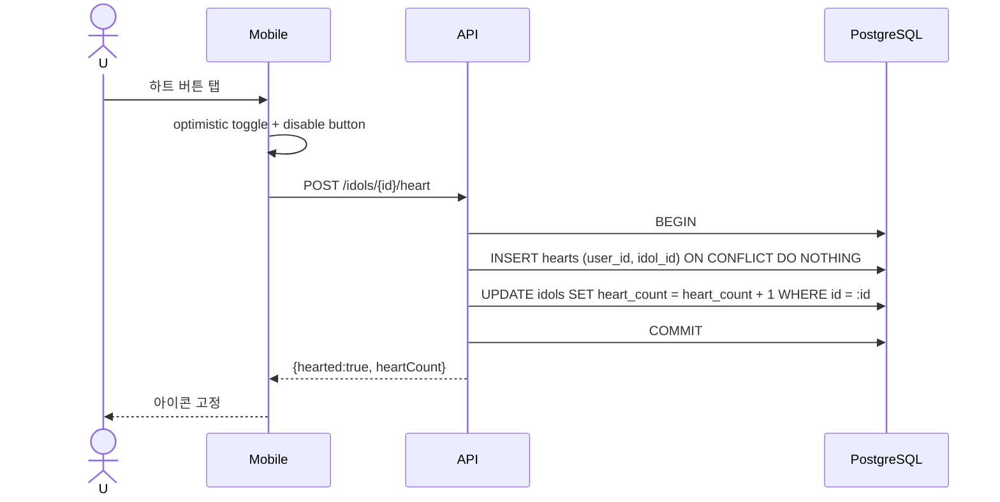
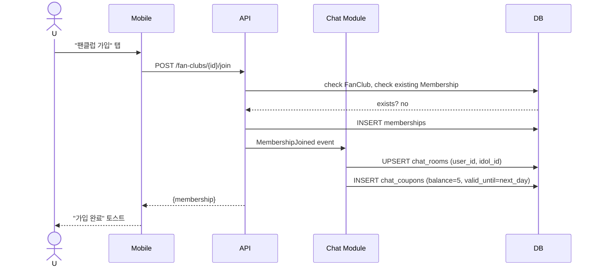
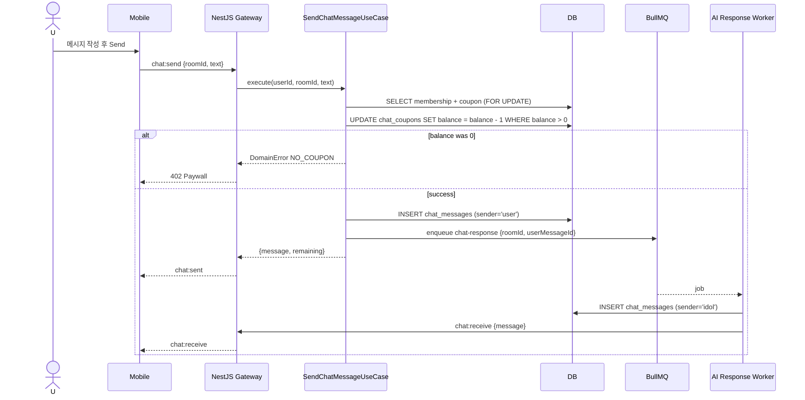
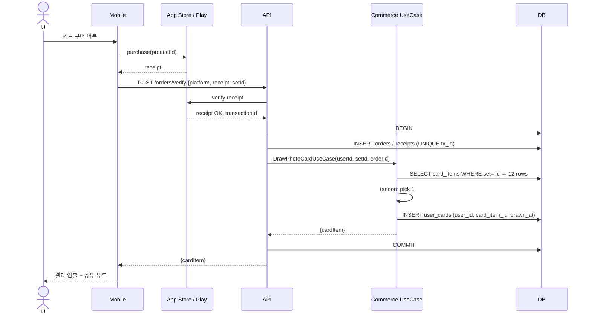
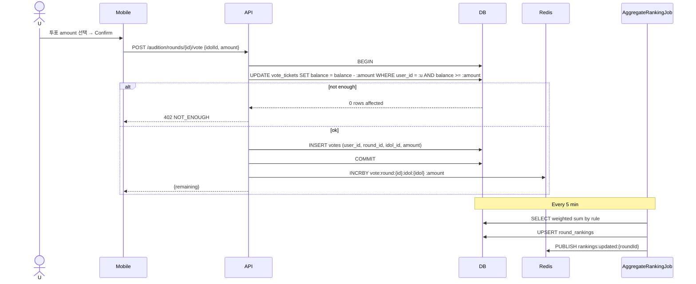
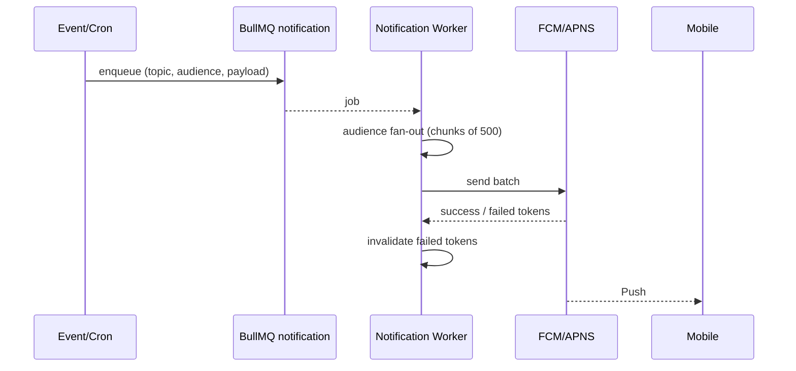
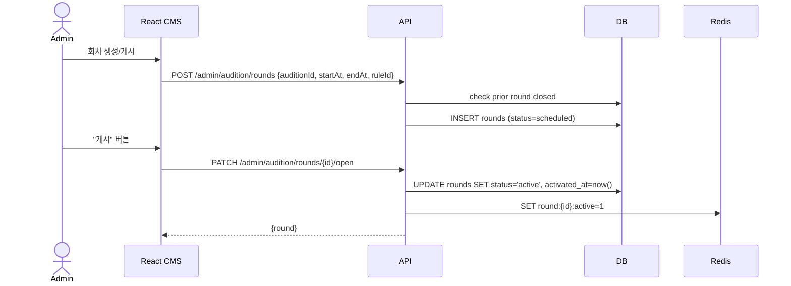

# A-idol — Sequence Diagrams (A-아이돌 시퀀스 다이어그램)

모든 주요 유즈케이스의 프론트↔백엔드↔외부시스템 상호작용을 Mermaid로 정의한다.

---

## SEQ-001 — Social Sign-in (소셜 로그인)

---

## SEQ-002 — Browse Idol List (프로필 목록)

---

## SEQ-003 — Heart / Follow Idol (좋아요·팔로우)

---

## SEQ-004 — Join Fan Club (팬클럽 가입)

---

## SEQ-005 — Send Chat Message (채팅 전송)

---

## SEQ-006 — Draw Photo Card (포토카드 랜덤 구매)

---

## SEQ-007 — Cast Vote (오디션 투표)

---

## SEQ-008 — Push Notification (푸시 발송)

---

## SEQ-009 — CMS: Open Audition Round (회차 개시)

