# A-idol — ERD & Database Schema v2.0.0

> **Convention 적용 기준**: Amoeba Code Convention v2
> - DB: `aidol_` prefix, `{colPrefix}_{name}` column
> - Entity: PascalCase + `Entity`, property camelCase
> - Enum: SCREAMING_SNAKE_CASE

---

## 1. 컬럼 Prefix 매핑표

| 테이블 | colPrefix | 설명 |
|--------|-----------|------|
| `aidol_users` | `usr_` | 팬 유저 |
| `aidol_agencies` | `agc_` | 소속사 |
| `aidol_idols` | `idl_` | AI 아이돌 |
| `aidol_idol_photos` | `ipp_` | 아이돌 사진 |
| `aidol_idol_schedules` | `isc_` | 아이돌 일정 |
| `aidol_idol_chat_configs` | `icc_` | 채팅 설정 |
| `aidol_fan_clubs` | `fcl_` | 팬클럽 |
| `aidol_fan_club_memberships` | `fcm_` | 팬클럽 멤버십 |
| `aidol_chat_messages` | `msg_` | 채팅 메시지 |
| `aidol_photocard_sets` | `pcs_` | 포토카드 세트 |
| `aidol_photocards` | `pcd_` | 포토카드 |
| `aidol_user_photocards` | `upc_` | 유저 보유 포토카드 |
| `aidol_auditions` | `aud_` | 오디션 |
| `aidol_audition_rounds` | `rnd_` | 오디션 라운드 |
| `aidol_vote_type_configs` | `vtc_` | 투표 타입 설정 |
| `aidol_idol_audition_entries` | `iae_` | 아이돌 오디션 참가 |
| `aidol_votes` | `vot_` | 투표 |
| `aidol_voting_ticket_balances` | `vtb_` | 투표권 잔고 |
| `aidol_round_ticket_configs` | `rtc_` | 라운드 투표권 상품 |
| `aidol_purchase_transactions` | `ptr_` | 결제 트랜잭션 |
| `aidol_refresh_tokens` | `rtk_` | 리프레시 토큰 |
| `aidol_user_device_tokens` | `udt_` | 기기 토큰 |
| `aidol_user_idol_likes` | `uil_` | 좋아요 |
| `aidol_user_idol_follows` | `uif_` | 팔로우 |
| `aidol_fan_levels` | `flv_` | 팬 레벨 기준 |
| `aidol_user_level_stats` | `uls_` | 유저 레벨/XP 현황 |
| `aidol_xp_transactions` | `xpt_` | XP 획득 이력 |
| `aidol_xp_activity_configs` | `xac_` | XP 활동 설정 |

---

## 2. Entity Relationship Diagram (Mermaid)

```mermaid
erDiagram
  aidol_agencies ||--o{ aidol_idols : "has"
  aidol_idols ||--|| aidol_fan_clubs : "owns"
  aidol_idols ||--o{ aidol_photocard_sets : "has"
  aidol_idols ||--o{ aidol_idol_schedules : "has"
  aidol_idols ||--o{ aidol_idol_photos : "has"
  aidol_idols ||--o{ aidol_idol_chat_configs : "configures"
  aidol_photocard_sets ||--|{ aidol_photocards : "contains (12)"
  aidol_fan_clubs ||--o{ aidol_fan_club_memberships : "has"
  aidol_users ||--o{ aidol_fan_club_memberships : "joins"
  aidol_users ||--o{ aidol_user_idol_likes : "likes"
  aidol_users ||--o{ aidol_user_idol_follows : "follows"
  aidol_users ||--o{ aidol_user_photocards : "owns"
  aidol_users ||--o{ aidol_chat_messages : "sends"
  aidol_users ||--o{ aidol_votes : "casts"
  aidol_users ||--o{ aidol_purchase_transactions : "makes"
  aidol_users ||--o{ aidol_refresh_tokens : "holds"
  aidol_users ||--o{ aidol_user_device_tokens : "registers"
  aidol_users ||--o{ aidol_voting_ticket_balances : "has"
  aidol_users ||--|| aidol_user_level_stats : "tracks"
  aidol_photocards ||--o{ aidol_user_photocards : "owned_by"
  aidol_auditions ||--|{ aidol_audition_rounds : "contains"
  aidol_auditions ||--o{ aidol_idol_audition_entries : "includes"
  aidol_audition_rounds ||--o{ aidol_vote_type_configs : "configures"
  aidol_audition_rounds ||--o{ aidol_votes : "receives"
  aidol_audition_rounds ||--o{ aidol_voting_ticket_balances : "for"
  aidol_audition_rounds ||--o{ aidol_round_ticket_configs : "has"
  aidol_idols ||--o{ aidol_idol_audition_entries : "participates"
  aidol_idols ||--o{ aidol_votes : "receives"
  aidol_fan_clubs ||--o{ aidol_chat_messages : "scoped_to"
  aidol_fan_levels ||--o{ aidol_user_level_stats : "defines"
  aidol_user_level_stats ||--o{ aidol_xp_transactions : "logs"
```



---

## 3. PostgreSQL DDL Schema (Convention v2)

```sql
-- ============================================================
-- A-idol Database Schema v2.0.0
-- PostgreSQL 15+
-- Convention: Amoeba Code Convention v2
-- DB Name: db_aidol
-- Table Prefix: aidol_
-- ============================================================

CREATE EXTENSION IF NOT EXISTS "uuid-ossp";
CREATE EXTENSION IF NOT EXISTS "pgcrypto";

-- ── Enum Types (SCREAMING_SNAKE_CASE) ───────────────────────

CREATE TYPE user_status_type       AS ENUM ('ACTIVE', 'SUSPENDED', 'DELETED');
CREATE TYPE idol_status_type       AS ENUM ('ACTIVE', 'INACTIVE', 'DELETED');
CREATE TYPE fan_club_status_type   AS ENUM ('ACTIVE', 'INACTIVE');
CREATE TYPE photocard_rarity_type  AS ENUM ('COMMON', 'RARE', 'EPIC');
CREATE TYPE message_type_type      AS ENUM ('USER', 'IDOL_AI', 'AUTO');
CREATE TYPE audition_status_type   AS ENUM ('DRAFT', 'ACTIVE', 'COMPLETED');
CREATE TYPE round_type_type        AS ENUM ('PRELIMINARY', 'FINAL');
CREATE TYPE round_status_type      AS ENUM ('PENDING', 'ACTIVE', 'CLOSED', 'FINALIZED');
CREATE TYPE vote_type_type         AS ENUM ('ONLINE', 'SMS', 'POPULARITY');
CREATE TYPE entry_status_type      AS ENUM ('PARTICIPATING', 'ADVANCED', 'ELIMINATED');
CREATE TYPE purchase_platform_type AS ENUM ('IOS', 'ANDROID', 'WEB');
CREATE TYPE product_type_type      AS ENUM ('CHAT_COUPON', 'VOTE_TICKET', 'PHOTOCARD_PULL');
CREATE TYPE purchase_status_type   AS ENUM ('PENDING', 'COMPLETED', 'FAILED', 'REFUNDED');
CREATE TYPE schedule_type_type     AS ENUM ('BROADCAST', 'CONCERT', 'FANMEETING', 'OTHER');
CREATE TYPE auth_provider_type     AS ENUM ('KAKAO', 'APPLE', 'GOOGLE', 'EMAIL');
CREATE TYPE xp_activity_type       AS ENUM (
  'DAILY_LOGIN', 'LOGIN_STREAK', 'CHAT_MESSAGE',
  'VOTE_TICKET_BUY', 'VOTE_CAST', 'PHOTOCARD_PULL',
  'FANCLUB_JOIN', 'PROFILE_COMPLETE', 'IDOL_LIKE', 'IDOL_FOLLOW'
);

-- ── 소속사 (Agency) ──────────────────────────────────────────

CREATE TABLE aidol_agencies (
  agc_id            UUID          PRIMARY KEY DEFAULT uuid_generate_v4(),
  agc_name          VARCHAR(100)  NOT NULL,
  agc_logo_url      TEXT,
  agc_contact_email VARCHAR(255),
  agc_is_active     BOOLEAN       NOT NULL DEFAULT TRUE,
  agc_created_at    TIMESTAMPTZ   NOT NULL DEFAULT NOW(),
  agc_updated_at    TIMESTAMPTZ   NOT NULL DEFAULT NOW(),
  agc_deleted_at    TIMESTAMPTZ,
  CONSTRAINT pk_aidol_agencies PRIMARY KEY (agc_id)
);

-- ── AI 아이돌 (Idol) ─────────────────────────────────────────

CREATE TABLE aidol_idols (
  idl_id               UUID              PRIMARY KEY DEFAULT uuid_generate_v4(),
  agc_id               UUID              NOT NULL REFERENCES aidol_agencies(agc_id),
  idl_stage_name       VARCHAR(50)       NOT NULL,
  idl_real_name        VARCHAR(50),
  idl_birthday         DATE,
  idl_debut_date       DATE,
  idl_concept_tags     TEXT[]            NOT NULL DEFAULT '{}',
  idl_bio_kr           TEXT,
  idl_character_traits JSONB             NOT NULL DEFAULT '{}',
  idl_display_order    INTEGER           NOT NULL DEFAULT 0,
  idl_like_count       INTEGER           NOT NULL DEFAULT 0,
  idl_follow_count     INTEGER           NOT NULL DEFAULT 0,
  idl_status           idol_status_type  NOT NULL DEFAULT 'ACTIVE',
  idl_created_at       TIMESTAMPTZ       NOT NULL DEFAULT NOW(),
  idl_updated_at       TIMESTAMPTZ       NOT NULL DEFAULT NOW(),
  idl_deleted_at       TIMESTAMPTZ,
  CONSTRAINT pk_aidol_idols PRIMARY KEY (idl_id),
  CONSTRAINT fk_aidol_idols_agencies FOREIGN KEY (agc_id) REFERENCES aidol_agencies(agc_id)
);

-- ── 아이돌 사진 (Idol Photo) ─────────────────────────────────

CREATE TABLE aidol_idol_photos (
  ipp_id         UUID        PRIMARY KEY DEFAULT uuid_generate_v4(),
  idl_id         UUID        NOT NULL REFERENCES aidol_idols(idl_id) ON DELETE CASCADE,
  ipp_image_url  TEXT        NOT NULL,
  ipp_is_profile BOOLEAN     NOT NULL DEFAULT FALSE,
  ipp_sort_order INTEGER     NOT NULL DEFAULT 0,
  ipp_created_at TIMESTAMPTZ NOT NULL DEFAULT NOW(),
  CONSTRAINT pk_aidol_idol_photos  PRIMARY KEY (ipp_id),
  CONSTRAINT fk_aidol_idol_photos_idols FOREIGN KEY (idl_id) REFERENCES aidol_idols(idl_id) ON DELETE CASCADE
);

-- ── 아이돌 일정 (Idol Schedule) ──────────────────────────────

CREATE TABLE aidol_idol_schedules (
  isc_id            UUID               PRIMARY KEY DEFAULT uuid_generate_v4(),
  idl_id            UUID               NOT NULL REFERENCES aidol_idols(idl_id) ON DELETE CASCADE,
  isc_schedule_type schedule_type_type NOT NULL,
  isc_title         VARCHAR(200)       NOT NULL,
  isc_start_at      TIMESTAMPTZ        NOT NULL,
  isc_end_at        TIMESTAMPTZ,
  isc_location      VARCHAR(200),
  isc_created_at    TIMESTAMPTZ        NOT NULL DEFAULT NOW(),
  CONSTRAINT pk_aidol_idol_schedules PRIMARY KEY (isc_id),
  CONSTRAINT fk_aidol_idol_schedules_idols FOREIGN KEY (idl_id) REFERENCES aidol_idols(idl_id) ON DELETE CASCADE
);

-- ── 채팅 설정 (Idol Chat Config) ────────────────────────────

CREATE TABLE aidol_idol_chat_configs (
  icc_id                 UUID        PRIMARY KEY DEFAULT uuid_generate_v4(),
  idl_id                 UUID        NOT NULL UNIQUE REFERENCES aidol_idols(idl_id),
  icc_daily_quota        INTEGER     NOT NULL DEFAULT 5,
  icc_auto_messages      JSONB       NOT NULL DEFAULT '{"MORNING":null,"AFTERNOON":null,"NIGHT":null}',
  icc_response_templates JSONB       NOT NULL DEFAULT '[]',
  icc_updated_at         TIMESTAMPTZ NOT NULL DEFAULT NOW(),
  CONSTRAINT pk_aidol_idol_chat_configs PRIMARY KEY (icc_id),
  CONSTRAINT fk_aidol_idol_chat_configs_idols FOREIGN KEY (idl_id) REFERENCES aidol_idols(idl_id),
  CONSTRAINT uq_aidol_idol_chat_configs_idol UNIQUE (idl_id)
);

-- ── 팬 유저 (User) ───────────────────────────────────────────

CREATE TABLE aidol_users (
  usr_id                UUID              PRIMARY KEY DEFAULT uuid_generate_v4(),
  usr_provider          auth_provider_type NOT NULL,
  usr_provider_id       VARCHAR(255)      NOT NULL,
  usr_email             TEXT,            -- AES-256-GCM 암호화 저장
  usr_nickname          VARCHAR(20)       NOT NULL UNIQUE,
  usr_profile_image_url TEXT,
  usr_coupon_balance    INTEGER           NOT NULL DEFAULT 0,
  usr_status            user_status_type  NOT NULL DEFAULT 'ACTIVE',
  usr_created_at        TIMESTAMPTZ       NOT NULL DEFAULT NOW(),
  usr_updated_at        TIMESTAMPTZ       NOT NULL DEFAULT NOW(),
  usr_deleted_at        TIMESTAMPTZ,
  CONSTRAINT pk_aidol_users PRIMARY KEY (usr_id),
  CONSTRAINT uq_aidol_users_nickname UNIQUE (usr_nickname),
  CONSTRAINT uq_aidol_users_provider UNIQUE (usr_provider, usr_provider_id)
);

-- ── 리프레시 토큰 (Refresh Token) ───────────────────────────

CREATE TABLE aidol_refresh_tokens (
  rtk_id         UUID        PRIMARY KEY DEFAULT uuid_generate_v4(),
  usr_id         UUID        NOT NULL REFERENCES aidol_users(usr_id) ON DELETE CASCADE,
  rtk_token_hash VARCHAR(255) NOT NULL UNIQUE,
  rtk_expires_at TIMESTAMPTZ NOT NULL,
  rtk_created_at TIMESTAMPTZ NOT NULL DEFAULT NOW(),
  rtk_revoked_at TIMESTAMPTZ,
  CONSTRAINT pk_aidol_refresh_tokens PRIMARY KEY (rtk_id),
  CONSTRAINT fk_aidol_refresh_tokens_users FOREIGN KEY (usr_id) REFERENCES aidol_users(usr_id) ON DELETE CASCADE,
  CONSTRAINT uq_aidol_refresh_tokens_hash UNIQUE (rtk_token_hash)
);

-- ── 기기 토큰 (User Device Token) ───────────────────────────

CREATE TABLE aidol_user_device_tokens (
  udt_id           UUID        PRIMARY KEY DEFAULT uuid_generate_v4(),
  usr_id           UUID        NOT NULL REFERENCES aidol_users(usr_id) ON DELETE CASCADE,
  udt_platform     VARCHAR(10) NOT NULL,   -- 'IOS' | 'ANDROID'
  udt_device_token TEXT        NOT NULL,
  udt_updated_at   TIMESTAMPTZ NOT NULL DEFAULT NOW(),
  CONSTRAINT pk_aidol_user_device_tokens PRIMARY KEY (udt_id),
  CONSTRAINT fk_aidol_user_device_tokens_users FOREIGN KEY (usr_id) REFERENCES aidol_users(usr_id) ON DELETE CASCADE,
  CONSTRAINT uq_aidol_user_device_tokens UNIQUE (usr_id, udt_device_token)
);

-- ── 좋아요 (User Idol Like) ──────────────────────────────────

CREATE TABLE aidol_user_idol_likes (
  uil_id         UUID        PRIMARY KEY DEFAULT uuid_generate_v4(),
  usr_id         UUID        NOT NULL REFERENCES aidol_users(usr_id) ON DELETE CASCADE,
  idl_id         UUID        NOT NULL REFERENCES aidol_idols(idl_id) ON DELETE CASCADE,
  uil_created_at TIMESTAMPTZ NOT NULL DEFAULT NOW(),
  CONSTRAINT pk_aidol_user_idol_likes PRIMARY KEY (uil_id),
  CONSTRAINT fk_aidol_user_idol_likes_users FOREIGN KEY (usr_id) REFERENCES aidol_users(usr_id) ON DELETE CASCADE,
  CONSTRAINT fk_aidol_user_idol_likes_idols FOREIGN KEY (idl_id) REFERENCES aidol_idols(idl_id) ON DELETE CASCADE,
  CONSTRAINT uq_aidol_user_idol_likes UNIQUE (usr_id, idl_id)
);

-- ── 팔로우 (User Idol Follow) ────────────────────────────────

CREATE TABLE aidol_user_idol_follows (
  uif_id         UUID        PRIMARY KEY DEFAULT uuid_generate_v4(),
  usr_id         UUID        NOT NULL REFERENCES aidol_users(usr_id) ON DELETE CASCADE,
  idl_id         UUID        NOT NULL REFERENCES aidol_idols(idl_id) ON DELETE CASCADE,
  uif_created_at TIMESTAMPTZ NOT NULL DEFAULT NOW(),
  CONSTRAINT pk_aidol_user_idol_follows PRIMARY KEY (uif_id),
  CONSTRAINT fk_aidol_user_idol_follows_users FOREIGN KEY (usr_id) REFERENCES aidol_users(usr_id) ON DELETE CASCADE,
  CONSTRAINT fk_aidol_user_idol_follows_idols FOREIGN KEY (idl_id) REFERENCES aidol_idols(idl_id) ON DELETE CASCADE,
  CONSTRAINT uq_aidol_user_idol_follows UNIQUE (usr_id, idl_id)
);

-- ── 팬클럽 (Fan Club) ────────────────────────────────────────

CREATE TABLE aidol_fan_clubs (
  fcl_id              UUID                 PRIMARY KEY DEFAULT uuid_generate_v4(),
  idl_id              UUID                 NOT NULL UNIQUE REFERENCES aidol_idols(idl_id),
  fcl_name            VARCHAR(100)         NOT NULL,
  fcl_description     TEXT,
  fcl_thumbnail_url   TEXT,
  fcl_member_count    INTEGER              NOT NULL DEFAULT 0,
  fcl_status          fan_club_status_type NOT NULL DEFAULT 'ACTIVE',
  fcl_created_at      TIMESTAMPTZ          NOT NULL DEFAULT NOW(),
  fcl_updated_at      TIMESTAMPTZ          NOT NULL DEFAULT NOW(),
  CONSTRAINT pk_aidol_fan_clubs PRIMARY KEY (fcl_id),
  CONSTRAINT fk_aidol_fan_clubs_idols FOREIGN KEY (idl_id) REFERENCES aidol_idols(idl_id),
  CONSTRAINT uq_aidol_fan_clubs_idol UNIQUE (idl_id)
);

-- ── 팬클럽 멤버십 (Fan Club Membership) ─────────────────────

CREATE TABLE aidol_fan_club_memberships (
  fcm_id         UUID        PRIMARY KEY DEFAULT uuid_generate_v4(),
  usr_id         UUID        NOT NULL REFERENCES aidol_users(usr_id) ON DELETE CASCADE,
  fcl_id         UUID        NOT NULL REFERENCES aidol_fan_clubs(fcl_id) ON DELETE CASCADE,
  fcm_joined_at  TIMESTAMPTZ NOT NULL DEFAULT NOW(),
  fcm_deleted_at TIMESTAMPTZ,            -- soft delete = 탈퇴
  CONSTRAINT pk_aidol_fan_club_memberships PRIMARY KEY (fcm_id),
  CONSTRAINT fk_aidol_fan_club_memberships_users     FOREIGN KEY (usr_id) REFERENCES aidol_users(usr_id) ON DELETE CASCADE,
  CONSTRAINT fk_aidol_fan_club_memberships_fan_clubs FOREIGN KEY (fcl_id) REFERENCES aidol_fan_clubs(fcl_id) ON DELETE CASCADE,
  CONSTRAINT uq_aidol_fan_club_memberships UNIQUE (usr_id, fcl_id)
);

-- ── 채팅 메시지 (Chat Message) ───────────────────────────────

CREATE TABLE aidol_chat_messages (
  msg_id                  UUID               PRIMARY KEY DEFAULT uuid_generate_v4(),
  fcl_id                  UUID               NOT NULL REFERENCES aidol_fan_clubs(fcl_id),
  usr_id                  UUID               REFERENCES aidol_users(usr_id) ON DELETE SET NULL,
  idl_id                  UUID               NOT NULL REFERENCES aidol_idols(idl_id),
  msg_content             TEXT               NOT NULL,
  msg_message_type        message_type_type  NOT NULL,
  msg_is_excluded_quota   BOOLEAN            NOT NULL DEFAULT FALSE,
  msg_created_at          TIMESTAMPTZ        NOT NULL DEFAULT NOW(),
  CONSTRAINT pk_aidol_chat_messages PRIMARY KEY (msg_id),
  CONSTRAINT fk_aidol_chat_messages_fan_clubs FOREIGN KEY (fcl_id) REFERENCES aidol_fan_clubs(fcl_id),
  CONSTRAINT fk_aidol_chat_messages_users     FOREIGN KEY (usr_id) REFERENCES aidol_users(usr_id) ON DELETE SET NULL,
  CONSTRAINT fk_aidol_chat_messages_idols     FOREIGN KEY (idl_id) REFERENCES aidol_idols(idl_id)
);

-- ── 포토카드 세트 (Photocard Set) ────────────────────────────

CREATE TABLE aidol_photocard_sets (
  pcs_id         UUID        PRIMARY KEY DEFAULT uuid_generate_v4(),
  idl_id         UUID        NOT NULL REFERENCES aidol_idols(idl_id),
  pcs_name       VARCHAR(100) NOT NULL,
  pcs_price_krw  INTEGER     NOT NULL,
  pcs_is_active  BOOLEAN     NOT NULL DEFAULT TRUE,
  pcs_created_at TIMESTAMPTZ NOT NULL DEFAULT NOW(),
  pcs_updated_at TIMESTAMPTZ NOT NULL DEFAULT NOW(),
  CONSTRAINT pk_aidol_photocard_sets PRIMARY KEY (pcs_id),
  CONSTRAINT fk_aidol_photocard_sets_idols FOREIGN KEY (idl_id) REFERENCES aidol_idols(idl_id)
);

-- ── 포토카드 (Photocard) ─────────────────────────────────────

CREATE TABLE aidol_photocards (
  pcd_id         UUID                  PRIMARY KEY DEFAULT uuid_generate_v4(),
  pcs_id         UUID                  NOT NULL REFERENCES aidol_photocard_sets(pcs_id) ON DELETE CASCADE,
  pcd_card_name  VARCHAR(100)          NOT NULL,
  pcd_image_url  TEXT                  NOT NULL,
  pcd_rarity     photocard_rarity_type NOT NULL DEFAULT 'COMMON',
  pcd_slot_index INTEGER               NOT NULL CHECK (pcd_slot_index BETWEEN 0 AND 11),
  CONSTRAINT pk_aidol_photocards PRIMARY KEY (pcd_id),
  CONSTRAINT fk_aidol_photocards_sets FOREIGN KEY (pcs_id) REFERENCES aidol_photocard_sets(pcs_id) ON DELETE CASCADE,
  CONSTRAINT uq_aidol_photocards_slot UNIQUE (pcs_id, pcd_slot_index)
);

-- ── 유저 보유 포토카드 (User Photocard) ─────────────────────

CREATE TABLE aidol_user_photocards (
  upc_id               UUID        PRIMARY KEY DEFAULT uuid_generate_v4(),
  usr_id               UUID        NOT NULL REFERENCES aidol_users(usr_id) ON DELETE CASCADE,
  pcd_id               UUID        NOT NULL REFERENCES aidol_photocards(pcd_id),
  upc_count_owned      INTEGER     NOT NULL DEFAULT 1,
  upc_first_acquired_at TIMESTAMPTZ NOT NULL DEFAULT NOW(),
  upc_last_acquired_at  TIMESTAMPTZ NOT NULL DEFAULT NOW(),
  CONSTRAINT pk_aidol_user_photocards PRIMARY KEY (upc_id),
  CONSTRAINT fk_aidol_user_photocards_users      FOREIGN KEY (usr_id) REFERENCES aidol_users(usr_id) ON DELETE CASCADE,
  CONSTRAINT fk_aidol_user_photocards_photocards FOREIGN KEY (pcd_id) REFERENCES aidol_photocards(pcd_id),
  CONSTRAINT uq_aidol_user_photocards UNIQUE (usr_id, pcd_id)
);

-- ── 오디션 (Audition) ────────────────────────────────────────

CREATE TABLE aidol_auditions (
  aud_id                 UUID                 PRIMARY KEY DEFAULT uuid_generate_v4(),
  aud_name               VARCHAR(200)         NOT NULL,
  aud_description        TEXT,
  aud_start_date         DATE                 NOT NULL,
  aud_advance_threshold  INTEGER              NOT NULL DEFAULT 10,
  aud_status             audition_status_type NOT NULL DEFAULT 'DRAFT',
  aud_created_at         TIMESTAMPTZ          NOT NULL DEFAULT NOW(),
  aud_updated_at         TIMESTAMPTZ          NOT NULL DEFAULT NOW(),
  CONSTRAINT pk_aidol_auditions PRIMARY KEY (aud_id)
);

-- ── 오디션 라운드 (Audition Round) ──────────────────────────

CREATE TABLE aidol_audition_rounds (
  rnd_id                    UUID               PRIMARY KEY DEFAULT uuid_generate_v4(),
  aud_id                    UUID               NOT NULL REFERENCES aidol_auditions(aud_id) ON DELETE CASCADE,
  rnd_round_no              INTEGER            NOT NULL,
  rnd_round_type            round_type_type    NOT NULL DEFAULT 'PRELIMINARY',
  rnd_start_at              TIMESTAMPTZ,
  rnd_end_at                TIMESTAMPTZ,
  rnd_status                round_status_type  NOT NULL DEFAULT 'PENDING',
  rnd_max_tickets_per_user  INTEGER            NOT NULL DEFAULT 10,
  rnd_created_at            TIMESTAMPTZ        NOT NULL DEFAULT NOW(),
  CONSTRAINT pk_aidol_audition_rounds PRIMARY KEY (rnd_id),
  CONSTRAINT fk_aidol_audition_rounds_auditions FOREIGN KEY (aud_id) REFERENCES aidol_auditions(aud_id) ON DELETE CASCADE,
  CONSTRAINT uq_aidol_audition_rounds UNIQUE (aud_id, rnd_round_no)
);

-- ── 투표 타입 설정 (Vote Type Config) ────────────────────────

CREATE TABLE aidol_vote_type_configs (
  vtc_id         UUID            PRIMARY KEY DEFAULT uuid_generate_v4(),
  rnd_id         UUID            NOT NULL REFERENCES aidol_audition_rounds(rnd_id) ON DELETE CASCADE,
  vtc_vote_type  vote_type_type  NOT NULL,
  vtc_weight     DECIMAL(5,4)    NOT NULL,
  CONSTRAINT pk_aidol_vote_type_configs PRIMARY KEY (vtc_id),
  CONSTRAINT fk_aidol_vote_type_configs_rounds FOREIGN KEY (rnd_id) REFERENCES aidol_audition_rounds(rnd_id) ON DELETE CASCADE,
  CONSTRAINT uq_aidol_vote_type_configs UNIQUE (rnd_id, vtc_vote_type),
  CONSTRAINT chk_aidol_vtc_weight_positive CHECK (vtc_weight > 0 AND vtc_weight <= 1)
);

-- ── 아이돌 오디션 참가 (Idol Audition Entry) ─────────────────

CREATE TABLE aidol_idol_audition_entries (
  iae_id          UUID               PRIMARY KEY DEFAULT uuid_generate_v4(),
  aud_id          UUID               NOT NULL REFERENCES aidol_auditions(aud_id),
  rnd_id          UUID               NOT NULL REFERENCES aidol_audition_rounds(rnd_id),
  idl_id          UUID               NOT NULL REFERENCES aidol_idols(idl_id),
  iae_final_score DECIMAL(15,4),
  iae_rank        INTEGER,
  iae_status      entry_status_type  NOT NULL DEFAULT 'PARTICIPATING',
  CONSTRAINT pk_aidol_idol_audition_entries PRIMARY KEY (iae_id),
  CONSTRAINT fk_aidol_iae_auditions FOREIGN KEY (aud_id) REFERENCES aidol_auditions(aud_id),
  CONSTRAINT fk_aidol_iae_rounds    FOREIGN KEY (rnd_id) REFERENCES aidol_audition_rounds(rnd_id),
  CONSTRAINT fk_aidol_iae_idols     FOREIGN KEY (idl_id) REFERENCES aidol_idols(idl_id),
  CONSTRAINT uq_aidol_idol_audition_entries UNIQUE (rnd_id, idl_id)
);

-- ── 투표 (Vote) ──────────────────────────────────────────────

CREATE TABLE aidol_votes (
  vot_id        UUID           PRIMARY KEY DEFAULT uuid_generate_v4(),
  usr_id        UUID           NOT NULL REFERENCES aidol_users(usr_id),
  idl_id        UUID           NOT NULL REFERENCES aidol_idols(idl_id),
  rnd_id        UUID           NOT NULL REFERENCES aidol_audition_rounds(rnd_id),
  vot_count     INTEGER        NOT NULL DEFAULT 1 CHECK (vot_count > 0),
  vot_vote_type vote_type_type NOT NULL,
  vot_voted_at  TIMESTAMPTZ    NOT NULL DEFAULT NOW(),
  CONSTRAINT pk_aidol_votes PRIMARY KEY (vot_id),
  CONSTRAINT fk_aidol_votes_users  FOREIGN KEY (usr_id) REFERENCES aidol_users(usr_id),
  CONSTRAINT fk_aidol_votes_idols  FOREIGN KEY (idl_id) REFERENCES aidol_idols(idl_id),
  CONSTRAINT fk_aidol_votes_rounds FOREIGN KEY (rnd_id) REFERENCES aidol_audition_rounds(rnd_id)
);

-- ── 투표권 잔고 (Voting Ticket Balance) ─────────────────────

CREATE TABLE aidol_voting_ticket_balances (
  vtb_id         UUID        PRIMARY KEY DEFAULT uuid_generate_v4(),
  usr_id         UUID        NOT NULL REFERENCES aidol_users(usr_id) ON DELETE CASCADE,
  rnd_id         UUID        NOT NULL REFERENCES aidol_audition_rounds(rnd_id),
  vtb_qty        INTEGER     NOT NULL DEFAULT 0 CHECK (vtb_qty >= 0),
  vtb_updated_at TIMESTAMPTZ NOT NULL DEFAULT NOW(),
  CONSTRAINT pk_aidol_voting_ticket_balances PRIMARY KEY (vtb_id),
  CONSTRAINT fk_aidol_vtb_users  FOREIGN KEY (usr_id) REFERENCES aidol_users(usr_id) ON DELETE CASCADE,
  CONSTRAINT fk_aidol_vtb_rounds FOREIGN KEY (rnd_id) REFERENCES aidol_audition_rounds(rnd_id),
  CONSTRAINT uq_aidol_voting_ticket_balances UNIQUE (usr_id, rnd_id)
);

-- ── 라운드 투표권 상품 (Round Ticket Config) ─────────────────

CREATE TABLE aidol_round_ticket_configs (
  rtc_id        UUID    PRIMARY KEY DEFAULT uuid_generate_v4(),
  rnd_id        UUID    NOT NULL REFERENCES aidol_audition_rounds(rnd_id),
  rtc_sku       VARCHAR(100) NOT NULL,
  rtc_qty       INTEGER NOT NULL,
  rtc_price_krw INTEGER NOT NULL,
  CONSTRAINT pk_aidol_round_ticket_configs PRIMARY KEY (rtc_id),
  CONSTRAINT fk_aidol_round_ticket_configs_rounds FOREIGN KEY (rnd_id) REFERENCES aidol_audition_rounds(rnd_id)
);

-- ── 결제 트랜잭션 (Purchase Transaction) ────────────────────

CREATE TABLE aidol_purchase_transactions (
  ptr_id               UUID                  PRIMARY KEY DEFAULT uuid_generate_v4(),
  usr_id               UUID                  NOT NULL REFERENCES aidol_users(usr_id),
  ptr_platform         purchase_platform_type NOT NULL,
  ptr_transaction_id   VARCHAR(500)          NOT NULL,
  ptr_idempotency_key  VARCHAR(500)          NOT NULL UNIQUE,
  ptr_sku              VARCHAR(100)          NOT NULL,
  ptr_product_type     product_type_type     NOT NULL,
  ptr_amount_krw       INTEGER               NOT NULL,
  ptr_is_consumed      BOOLEAN               NOT NULL DEFAULT FALSE,
  ptr_status           purchase_status_type  NOT NULL DEFAULT 'COMPLETED',
  ptr_context          JSONB                 NOT NULL DEFAULT '{}',
  ptr_created_at       TIMESTAMPTZ           NOT NULL DEFAULT NOW(),
  CONSTRAINT pk_aidol_purchase_transactions PRIMARY KEY (ptr_id),
  CONSTRAINT fk_aidol_purchase_transactions_users FOREIGN KEY (usr_id) REFERENCES aidol_users(usr_id),
  CONSTRAINT uq_aidol_purchase_transactions_idempotency UNIQUE (ptr_idempotency_key)
);

-- ── 팬 레벨 기준 (Fan Level) ────────────────────────────────

CREATE TABLE aidol_fan_levels (
  flv_level             INTEGER      PRIMARY KEY,              -- 1~5
  flv_name_kr           VARCHAR(20)  NOT NULL,
  flv_name_en           VARCHAR(30)  NOT NULL,
  flv_required_xp       INTEGER      NOT NULL,
  flv_badge_image_url   TEXT,
  flv_description       TEXT,
  flv_chat_quota_bonus  INTEGER      NOT NULL DEFAULT 0,
  flv_created_at        TIMESTAMPTZ  NOT NULL DEFAULT NOW(),
  CONSTRAINT pk_aidol_fan_levels PRIMARY KEY (flv_level)
);

-- ── 유저 레벨/XP 현황 (User Level Stats) ────────────────────

CREATE TABLE aidol_user_level_stats (
  uls_id              UUID        PRIMARY KEY DEFAULT uuid_generate_v4(),
  usr_id              UUID        NOT NULL UNIQUE REFERENCES aidol_users(usr_id) ON DELETE CASCADE,
  flv_level           INTEGER     NOT NULL DEFAULT 1 REFERENCES aidol_fan_levels(flv_level),
  uls_total_xp        INTEGER     NOT NULL DEFAULT 0,
  uls_login_streak    INTEGER     NOT NULL DEFAULT 0,
  uls_max_streak      INTEGER     NOT NULL DEFAULT 0,
  uls_last_login_date DATE,
  uls_updated_at      TIMESTAMPTZ NOT NULL DEFAULT NOW(),
  CONSTRAINT pk_aidol_user_level_stats PRIMARY KEY (uls_id),
  CONSTRAINT fk_aidol_uls_users       FOREIGN KEY (usr_id)  REFERENCES aidol_users(usr_id) ON DELETE CASCADE,
  CONSTRAINT fk_aidol_uls_fan_levels  FOREIGN KEY (flv_level) REFERENCES aidol_fan_levels(flv_level),
  CONSTRAINT uq_aidol_user_level_stats_user UNIQUE (usr_id)
);

-- ── XP 획득 이력 (XP Transaction) ───────────────────────────

CREATE TABLE aidol_xp_transactions (
  xpt_id         UUID             PRIMARY KEY DEFAULT uuid_generate_v4(),
  usr_id         UUID             NOT NULL REFERENCES aidol_users(usr_id) ON DELETE CASCADE,
  xpt_xp_amount  INTEGER          NOT NULL,
  xpt_activity   xp_activity_type NOT NULL,
  xpt_ref_id     UUID,                         -- 연관 엔티티 ID (nullable)
  xpt_created_at TIMESTAMPTZ      NOT NULL DEFAULT NOW(),
  CONSTRAINT pk_aidol_xp_transactions PRIMARY KEY (xpt_id),
  CONSTRAINT fk_aidol_xp_transactions_users FOREIGN KEY (usr_id) REFERENCES aidol_users(usr_id) ON DELETE CASCADE
);

-- ── XP 활동 설정 (XP Activity Config) ───────────────────────

CREATE TABLE aidol_xp_activity_configs (
  xac_activity          xp_activity_type PRIMARY KEY,
  xac_xp_per_action     INTEGER          NOT NULL,
  xac_daily_limit       INTEGER,                      -- NULL = 무제한
  xac_cooldown_seconds  INTEGER          NOT NULL DEFAULT 0,
  xac_is_active         BOOLEAN          NOT NULL DEFAULT TRUE,
  xac_updated_at        TIMESTAMPTZ      NOT NULL DEFAULT NOW(),
  CONSTRAINT pk_aidol_xp_activity_configs PRIMARY KEY (xac_activity)
);

-- ── Indexes ─────────────────────────────────────────────────

-- aidol_users
CREATE INDEX idx_aidol_users_provider   ON aidol_users(usr_provider, usr_provider_id);
CREATE INDEX idx_aidol_users_nickname   ON aidol_users(usr_nickname);
CREATE INDEX idx_aidol_users_status     ON aidol_users(usr_status) WHERE usr_deleted_at IS NULL;

-- aidol_refresh_tokens
CREATE INDEX idx_aidol_refresh_tokens_hash ON aidol_refresh_tokens(rtk_token_hash);

-- aidol_user_device_tokens
CREATE INDEX idx_aidol_user_device_tokens_user ON aidol_user_device_tokens(usr_id);

-- aidol_idols
CREATE INDEX idx_aidol_idols_status_order ON aidol_idols(idl_status, idl_display_order)
  WHERE idl_status = 'ACTIVE';
CREATE INDEX idx_aidol_idols_agency       ON aidol_idols(agc_id);

-- aidol_user_idol_likes / follows
CREATE INDEX idx_aidol_uil_user ON aidol_user_idol_likes(usr_id);
CREATE INDEX idx_aidol_uil_idol ON aidol_user_idol_likes(idl_id);
CREATE INDEX idx_aidol_uif_user ON aidol_user_idol_follows(usr_id);
CREATE INDEX idx_aidol_uif_idol ON aidol_user_idol_follows(idl_id);

-- aidol_fan_club_memberships
CREATE INDEX idx_aidol_fcm_user ON aidol_fan_club_memberships(usr_id)
  WHERE fcm_deleted_at IS NULL;
CREATE INDEX idx_aidol_fcm_club ON aidol_fan_club_memberships(fcl_id)
  WHERE fcm_deleted_at IS NULL;

-- aidol_chat_messages (time-series — BRIN)
CREATE INDEX idx_aidol_msg_fanclub_time ON aidol_chat_messages(fcl_id, msg_created_at DESC);
CREATE INDEX idx_aidol_msg_user         ON aidol_chat_messages(usr_id);

-- aidol_votes
CREATE INDEX idx_aidol_vot_round_idol ON aidol_votes(rnd_id, idl_id);
CREATE INDEX idx_aidol_vot_user_round ON aidol_votes(usr_id, rnd_id);

-- aidol_voting_ticket_balances
CREATE INDEX idx_aidol_vtb_user_round ON aidol_voting_ticket_balances(usr_id, rnd_id);

-- aidol_user_photocards
CREATE INDEX idx_aidol_upc_user      ON aidol_user_photocards(usr_id);
CREATE INDEX idx_aidol_upc_photocard ON aidol_user_photocards(pcd_id);

-- aidol_purchase_transactions
CREATE INDEX idx_aidol_ptr_user ON aidol_purchase_transactions(usr_id, ptr_created_at DESC);

-- aidol_xp_transactions
CREATE INDEX idx_aidol_xpt_user ON aidol_xp_transactions(usr_id, xpt_created_at DESC);

-- ── Triggers ────────────────────────────────────────────────

-- auto updated_at
CREATE OR REPLACE FUNCTION aidol_set_updated_at()
RETURNS TRIGGER AS $$
BEGIN NEW.updated_at = NOW(); RETURN NEW; END;
$$ LANGUAGE plpgsql;

-- 컬럼명이 *_updated_at 패턴이므로 각 테이블별 트리거 명시
CREATE TRIGGER trg_aidol_agencies_updated_at
  BEFORE UPDATE ON aidol_agencies
  FOR EACH ROW EXECUTE FUNCTION aidol_set_updated_at();

CREATE TRIGGER trg_aidol_idols_updated_at
  BEFORE UPDATE ON aidol_idols
  FOR EACH ROW EXECUTE FUNCTION aidol_set_updated_at();

CREATE TRIGGER trg_aidol_fan_clubs_updated_at
  BEFORE UPDATE ON aidol_fan_clubs
  FOR EACH ROW EXECUTE FUNCTION aidol_set_updated_at();

CREATE TRIGGER trg_aidol_users_updated_at
  BEFORE UPDATE ON aidol_users
  FOR EACH ROW EXECUTE FUNCTION aidol_set_updated_at();

-- 팬클럽 member_count 동기화
CREATE OR REPLACE FUNCTION aidol_sync_fan_club_member_count()
RETURNS TRIGGER AS $$
BEGIN
  IF TG_OP = 'INSERT' THEN
    UPDATE aidol_fan_clubs SET fcl_member_count = fcl_member_count + 1
    WHERE fcl_id = NEW.fcl_id;
  ELSIF TG_OP = 'UPDATE' AND OLD.fcm_deleted_at IS NULL AND NEW.fcm_deleted_at IS NOT NULL THEN
    UPDATE aidol_fan_clubs SET fcl_member_count = GREATEST(fcl_member_count - 1, 0)
    WHERE fcl_id = NEW.fcl_id;
  END IF;
  RETURN NEW;
END;
$$ LANGUAGE plpgsql;

CREATE TRIGGER trg_aidol_membership_count
AFTER INSERT OR UPDATE ON aidol_fan_club_memberships
FOR EACH ROW EXECUTE FUNCTION aidol_sync_fan_club_member_count();

-- 아이돌 수 상한 검증 (최대 99명)
CREATE OR REPLACE FUNCTION aidol_check_idol_cap()
RETURNS TRIGGER AS $$
DECLARE active_count INTEGER;
BEGIN
  SELECT COUNT(*) INTO active_count
  FROM aidol_idols WHERE idl_status = 'ACTIVE';
  IF active_count >= 99 THEN
    RAISE EXCEPTION 'E5030: IDOL_CAP_REACHED — Maximum 99 active idols allowed';
  END IF;
  RETURN NEW;
END;
$$ LANGUAGE plpgsql;

CREATE TRIGGER trg_aidol_idol_cap
BEFORE INSERT ON aidol_idols
FOR EACH ROW EXECUTE FUNCTION aidol_check_idol_cap();

-- 투표 가중치 합산 검증 (Application Layer에서 1차 검증 후 DB 재검)
CREATE OR REPLACE FUNCTION aidol_check_vote_weight_sum()
RETURNS TRIGGER AS $$
DECLARE total_weight DECIMAL;
BEGIN
  SELECT COALESCE(SUM(vtc_weight), 0) INTO total_weight
  FROM aidol_vote_type_configs WHERE rnd_id = NEW.rnd_id;
  IF ABS(total_weight - 1.0) > 0.001 THEN
    RAISE EXCEPTION 'E5025: WEIGHT_SUM_INVALID — Vote weights must sum to 1.0 (current: %)', total_weight;
  END IF;
  RETURN NEW;
END;
$$ LANGUAGE plpgsql;
```

---

## 4. Entity 클래스 매핑 (TypeORM)

| 테이블 | Entity 클래스 | 파일명 |
|--------|--------------|--------|
| `aidol_users` | `UserEntity` | `user.entity.ts` |
| `aidol_agencies` | `AgencyEntity` | `agency.entity.ts` |
| `aidol_idols` | `IdolEntity` | `idol.entity.ts` |
| `aidol_idol_photos` | `IdolPhotoEntity` | `idol-photo.entity.ts` |
| `aidol_idol_schedules` | `IdolScheduleEntity` | `idol-schedule.entity.ts` |
| `aidol_idol_chat_configs` | `IdolChatConfigEntity` | `idol-chat-config.entity.ts` |
| `aidol_fan_clubs` | `FanClubEntity` | `fan-club.entity.ts` |
| `aidol_fan_club_memberships` | `FanClubMembershipEntity` | `fan-club-membership.entity.ts` |
| `aidol_chat_messages` | `ChatMessageEntity` | `chat-message.entity.ts` |
| `aidol_photocard_sets` | `PhotocardSetEntity` | `photocard-set.entity.ts` |
| `aidol_photocards` | `PhotocardEntity` | `photocard.entity.ts` |
| `aidol_user_photocards` | `UserPhotocardEntity` | `user-photocard.entity.ts` |
| `aidol_auditions` | `AuditionEntity` | `audition.entity.ts` |
| `aidol_audition_rounds` | `AuditionRoundEntity` | `audition-round.entity.ts` |
| `aidol_vote_type_configs` | `VoteTypeConfigEntity` | `vote-type-config.entity.ts` |
| `aidol_idol_audition_entries` | `IdolAuditionEntryEntity` | `idol-audition-entry.entity.ts` |
| `aidol_votes` | `VoteEntity` | `vote.entity.ts` |
| `aidol_voting_ticket_balances` | `VotingTicketBalanceEntity` | `voting-ticket-balance.entity.ts` |
| `aidol_round_ticket_configs` | `RoundTicketConfigEntity` | `round-ticket-config.entity.ts` |
| `aidol_purchase_transactions` | `PurchaseTransactionEntity` | `purchase-transaction.entity.ts` |
| `aidol_refresh_tokens` | `RefreshTokenEntity` | `refresh-token.entity.ts` |
| `aidol_user_device_tokens` | `UserDeviceTokenEntity` | `user-device-token.entity.ts` |
| `aidol_user_idol_likes` | `UserIdolLikeEntity` | `user-idol-like.entity.ts` |
| `aidol_user_idol_follows` | `UserIdolFollowEntity` | `user-idol-follow.entity.ts` |
| `aidol_fan_levels` | `FanLevelEntity` | `fan-level.entity.ts` |
| `aidol_user_level_stats` | `UserLevelStatEntity` | `user-level-stat.entity.ts` |
| `aidol_xp_transactions` | `XpTransactionEntity` | `xp-transaction.entity.ts` |
| `aidol_xp_activity_configs` | `XpActivityConfigEntity` | `xp-activity-config.entity.ts` |

---

## 5. Entity 코드 예시 (TypeORM Convention v2)

```typescript
// idol.entity.ts
@Entity('aidol_idols')
export class IdolEntity {
  @PrimaryGeneratedColumn('uuid', { name: 'idl_id' })
  idlId: string;

  @Column({ name: 'agc_id', type: 'uuid' })
  agcId: string;

  @Column({ name: 'idl_stage_name', length: 50 })
  idlStageName: string;

  @Column({ name: 'idl_real_name', type: 'varchar', length: 50, nullable: true })
  idlRealName: string | null;

  @Column({ name: 'idl_birthday', type: 'date', nullable: true })
  idlBirthday: string | null;

  @Column({ name: 'idl_concept_tags', type: 'text', array: true, default: '{}' })
  idlConceptTags: string[];

  @Column({ name: 'idl_bio_kr', type: 'text', nullable: true })
  idlBioKr: string | null;

  @Column({ name: 'idl_character_traits', type: 'jsonb', default: '{}' })
  idlCharacterTraits: Record<string, unknown>;

  @Column({ name: 'idl_display_order', type: 'int', default: 0 })
  idlDisplayOrder: number;

  @Column({ name: 'idl_like_count', type: 'int', default: 0 })
  idlLikeCount: number;

  @Column({ name: 'idl_follow_count', type: 'int', default: 0 })
  idlFollowCount: number;

  @Column({ name: 'idl_status', type: 'varchar', length: 20, default: 'ACTIVE' })
  idlStatus: string;

  @CreateDateColumn({ name: 'idl_created_at' })
  idlCreatedAt: Date;

  @UpdateDateColumn({ name: 'idl_updated_at' })
  idlUpdatedAt: Date;

  @DeleteDateColumn({ name: 'idl_deleted_at' })
  idlDeletedAt: Date | null;

  @ManyToOne(() => AgencyEntity)
  @JoinColumn({ name: 'agc_id' })
  agency: AgencyEntity;
}
```

---

## 6. Redis 키 설계 (Convention 적용)

| Key Pattern | Type | TTL | Purpose |
|-------------|------|-----|---------|
| `aidol:quota:{usr_id}:{idl_id}:{YYYY-MM-DD}` | String (int) | KST 자정 | 채팅 일일 쿼터 카운터 |
| `aidol:idol_rank:{rnd_id}` | Sorted Set | 라운드 FINALIZED까지 | 실시간 투표 순위 (통합) |
| `aidol:idol_rank:{rnd_id}:{vote_type}` | Sorted Set | 라운드 FINALIZED까지 | 투표 타입별 카운트 |
| `aidol:idol:list:page:{n}` | String (JSON) | 60s | 아이돌 목록 캐시 |
| `aidol:session:admin:{admin_id}` | String | 4h | 관리자 CMS 세션 |
| `aidol:rate:auth:{ip}` | String (int) | 60s | 인증 Rate Limit |
| `aidol:rate:vote:{usr_id}` | String (int) | 60s | 투표 Rate Limit |
| `aidol:xp:daily:{usr_id}:{activity}:{YYYY-MM-DD}` | String (int) | KST 자정 | XP 일일 한도 추적 |

---

## 7. 초기 Seed 데이터

```sql
-- 팬 레벨 기준 데이터
INSERT INTO aidol_fan_levels
  (flv_level, flv_name_kr, flv_name_en, flv_required_xp, flv_description, flv_chat_quota_bonus)
VALUES
  (1, '뉴팬',       'New Fan',      0,      '가입한 모든 팬',              0),
  (2, '팬',         'Fan',          1000,   '활동을 시작한 팬',             1),
  (3, '코어팬',     'Core Fan',     5000,   '꾸준히 활동하는 팬',           1),
  (4, '레전드팬',   'Legend Fan',   15000,  '오랜 팬 경력의 레전드',        2),
  (5, '아이돌메이커','Idol Maker',  35000,  '아이돌을 만드는 최정상 팬',    3);

-- XP 활동 설정 데이터
INSERT INTO aidol_xp_activity_configs
  (xac_activity, xac_xp_per_action, xac_daily_limit, xac_cooldown_seconds, xac_is_active)
VALUES
  ('DAILY_LOGIN',       10, 10,   0,   true),
  ('LOGIN_STREAK',       5, 50,   0,   true),
  ('CHAT_MESSAGE',       5, 50,   300, true),   -- 5분 쿨다운
  ('VOTE_TICKET_BUY',   20, 100,  0,   true),
  ('VOTE_CAST',         10, 100,  0,   true),
  ('PHOTOCARD_PULL',    30, 150,  0,   true),
  ('FANCLUB_JOIN',      50, NULL, 0,   true),
  ('PROFILE_COMPLETE', 100, NULL, 0,   true),
  ('IDOL_LIKE',          2, 20,   0,   true),
  ('IDOL_FOLLOW',        5, 25,   0,   true);
```
