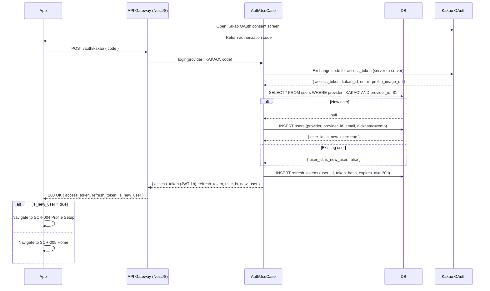
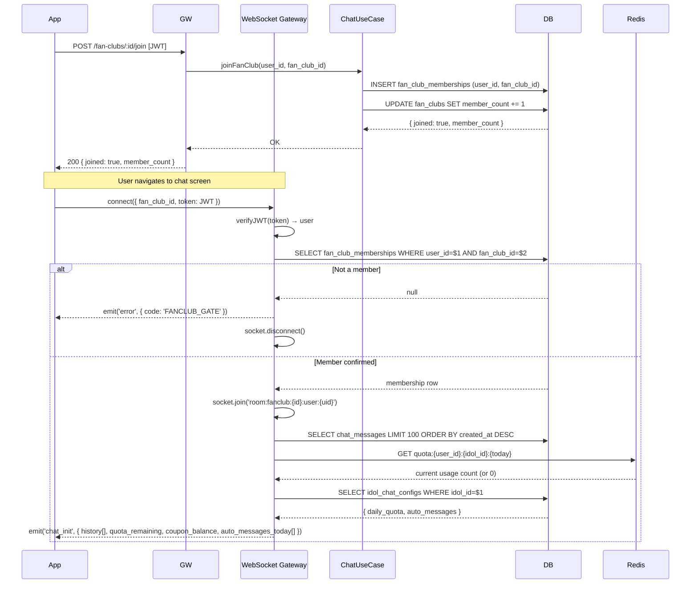
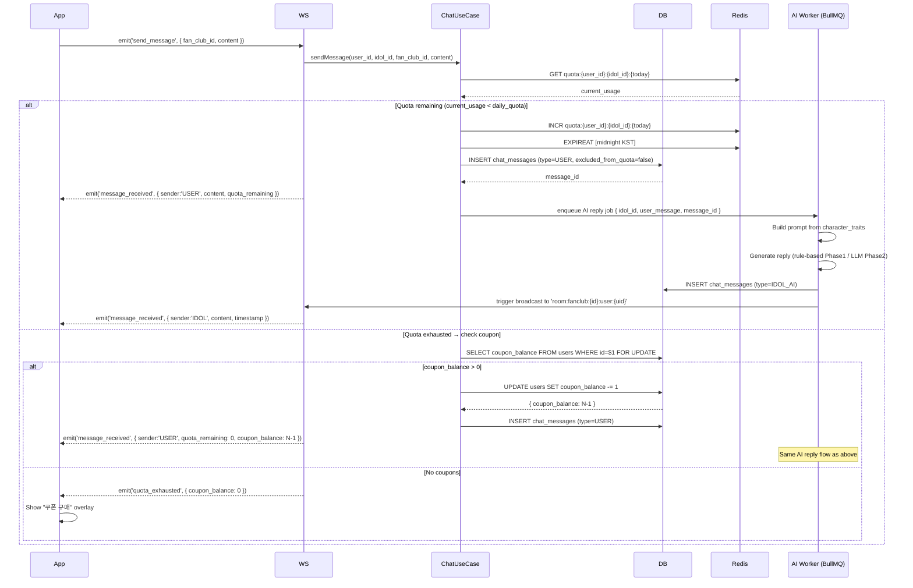
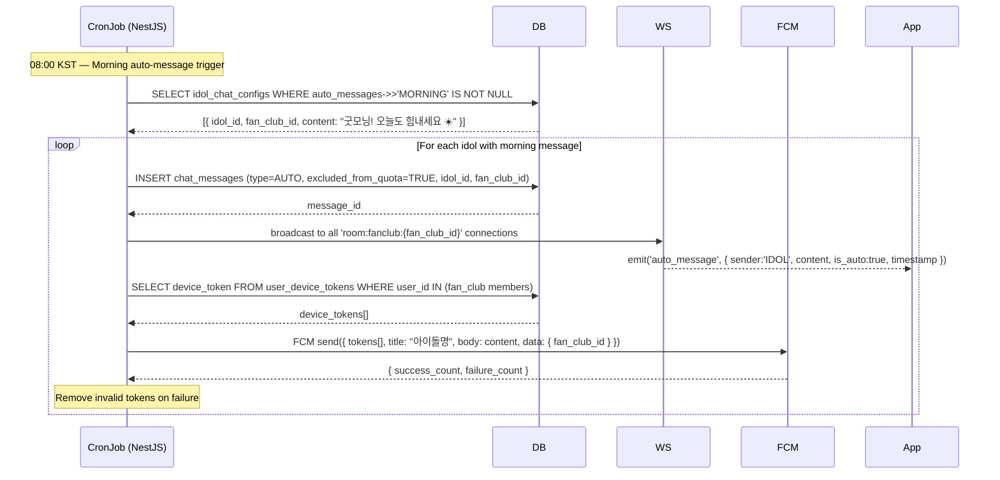
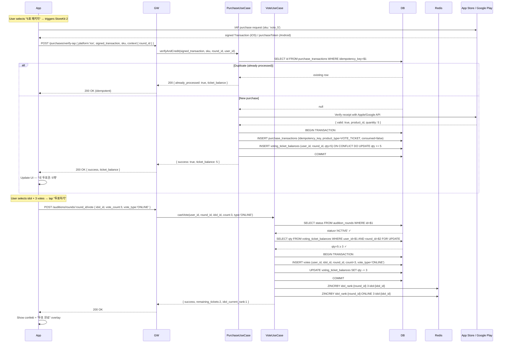
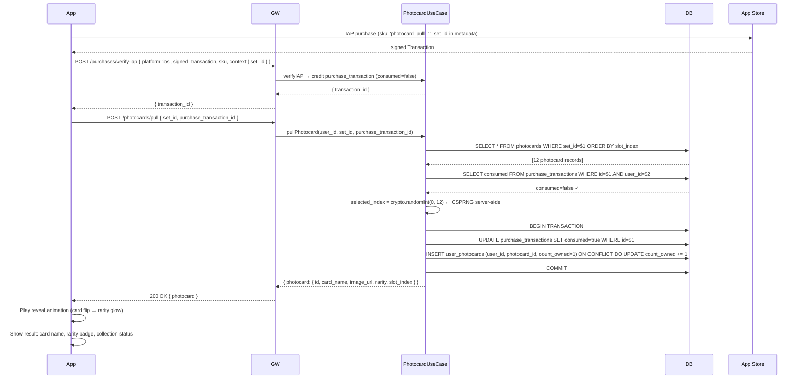
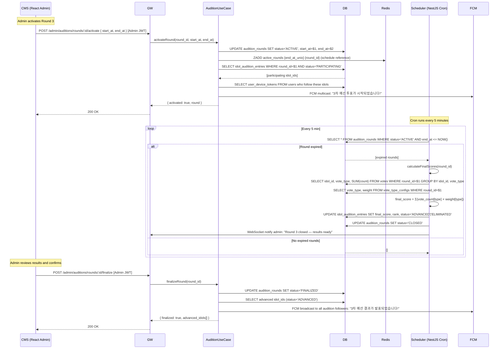
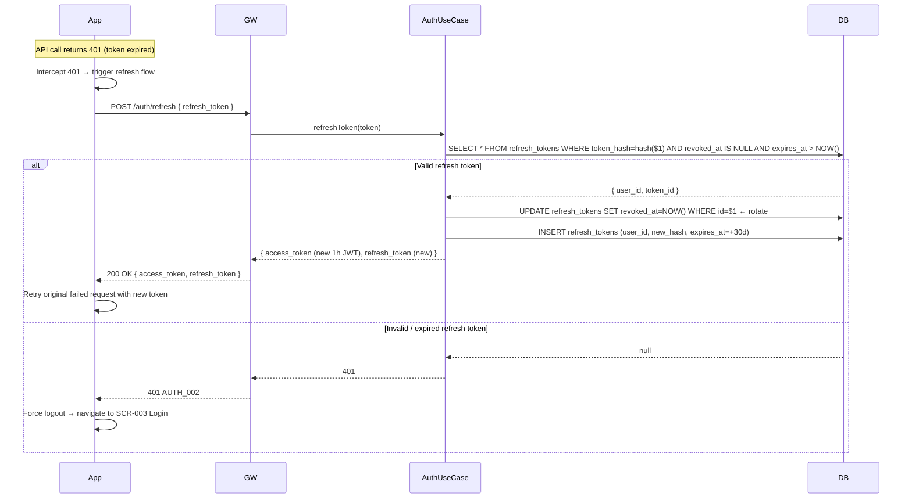

# A-idol — Sequence Diagrams (시퀀스 다이어그램)

> **Participants legend**:
> - **App** — React Native mobile client
> - **CMS** — React admin web client
> - **GW** — NestJS API Gateway (HTTP Controllers)
> - **WS** — NestJS WebSocket Gateway (Socket.io)
> - **UC** — Application Use Case layer
> - **DB** — PostgreSQL
> - **Redis** — Redis cache / rate limiter
> - **SYS** — Background scheduler / BullMQ worker
> - **Ext** — External services (Kakao, Apple, Google Play, App Store, FCM)

---

## SEQ-001 — Kakao Social Login (카카오 소셜 로그인)



---

## SEQ-002 — Idol List & Like Toggle (아이돌 목록 조회 + 좋아요)

```mermaid
sequenceDiagram
  participant App
  participant GW
  participant UC as IdolUseCase
  participant Redis
  participant DB

  App->>GW: GET /idols?page=1&limit=20 [JWT]
  GW->>Redis: GET idol:list:page:1
  alt Cache hit
    Redis-->>GW: cached JSON
    GW-->>App: 200 OK (cached)
  else Cache miss
    Redis-->>GW: null
    GW->>UC: getIdolList(page=1, user_id)
    UC->>DB: SELECT idols + LEFT JOIN likes/follows WHERE user_id=$1
    DB-->>UC: idol list with is_liked_by_me, is_followed_by_me
    UC->>Redis: SET idol:list:page:1 EX 60
    UC-->>GW: idol list
    GW-->>App: 200 OK { idols[], total }
  end

  Note over App: User taps ❤️ on idol card (optimistic update)
  App->>App: Immediately toggle heart UI (optimistic)
  App->>GW: POST /idols/:id/like [JWT]
  GW->>UC: toggleLike(user_id, idol_id)
  UC->>DB: BEGIN TRANSACTION
  UC->>DB: SELECT FROM user_idol_likes WHERE user_id=$1 AND idol_id=$2 FOR UPDATE
  alt Like exists → Unlike
    DB-->>UC: row found
    UC->>DB: DELETE user_idol_likes; UPDATE idols SET like_count -= 1
    DB-->>UC: { liked: false, like_count: N-1 }
  else No like → Like
    DB-->>UC: null
    UC->>DB: INSERT user_idol_likes; UPDATE idols SET like_count += 1
    DB-->>UC: { liked: true, like_count: N+1 }
  end
  UC->>DB: COMMIT
  UC->>Redis: DEL idol:list:page:* (cache invalidation)
  UC-->>GW: { liked, like_count }
  GW-->>App: 200 OK { liked, like_count }
  App->>App: Confirm UI (or revert if server disagrees)
```

---

## SEQ-003 — Fan Club Join & Chat Init (팬클럽 가입 + 채팅 시작)



---

## SEQ-004 — Send Chat Message + Quota Check (메시지 전송 + 쿼터 처리)



---

## SEQ-005 — Auto-Message Delivery (자동 메시지 발송)



---

## SEQ-006 — IAP Voting Ticket Purchase + Vote Cast (투표권 구매 + 투표)



---

## SEQ-007 — Photocard Gacha (포토카드 가챠)



---

## SEQ-008 — Admin: Activate Round + Close & Calculate (오디션 회차 활성화 + 마감 집계)



---

## SEQ-009 — JWT Refresh (JWT 갱신)



---

## Summary: Sequence ↔ Use Case Mapping (시퀀스 ↔ 유즈케이스 매핑)

| SEQ ID | Scenario | Use Case | Key Services |
|--------|----------|----------|-------------|
| SEQ-001 | Kakao login | AuthUseCase.login | Kakao OAuth, DB, JWT |
| SEQ-002 | Idol list + Like | IdolUseCase | Redis cache, DB transaction |
| SEQ-003 | Fan club join + Chat init | ChatUseCase | WS Gateway, DB gate check |
| SEQ-004 | Chat message + Quota | ChatUseCase | Redis quota, BullMQ, AI worker |
| SEQ-005 | Auto-message | AutoMessageScheduler | CronJob, FCM, WS broadcast |
| SEQ-006 | IAP + Vote cast | PurchaseUseCase, VoteUseCase | App Store API, Redis ZINCRBY |
| SEQ-007 | Photocard gacha | PhotocardUseCase | CSPRNG, S3, DB transaction |
| SEQ-008 | Admin round ops | AuditionUseCase | Scheduler, FCM, weighted score |
| SEQ-009 | JWT refresh | AuthUseCase.refresh | Token rotation, DB |
